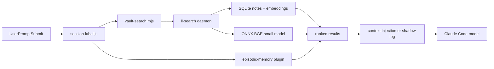
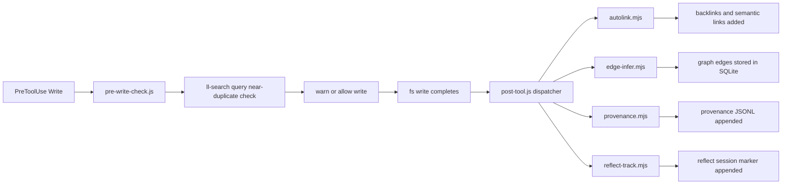

# architecture

learning-loop is a Claude Code plugin with three runtime layers: a JS plugin surface (hooks + scripts), a Rust search daemon (`ll-search`), and a Rust library crate (`ll-core`). This document maps the repo, shows how data flows at runtime, and lists the invariants that must hold across all layers.

Read the baseline docs before touching code:

- `docs/baseline/rust.md` -- ll-core and ll-search conventions
- `docs/baseline/plugin.md` -- hook and script conventions
- `docs/baseline/cross-cutting.md` -- versioning, perf, observability

---

## repo map

```
learning-loop/
  plugin/               -- the installed plugin (marketplace source ./plugin)
    .claude-plugin/     -- plugin manifest (plugin.json)
    hooks/              -- Claude Code lifecycle hooks (entry: *.js)
      lib/              -- hook-shared helpers (common, dream-gate, io, inject, snapshot)
      modules/          -- post-tool modules (provenance, reflect-track, autolink, edge-infer)
      session-start/    -- session-start submodules (context-assembly, watch-daemon,
                           vault-snapshot, cache-cleanup, health-detector, update-check,
                           update-check-worker)
      session-start.js  -- vault context injection on session open
      session-label.js  -- just-in-time injection pipeline on each prompt
      post-tool.js      -- coalesced PostToolUse dispatcher (Write|Edit|Agent|Skill)
      pre-write-check.js  -- duplicate + added-dash gate before vault writes and edits
      stop-nudge.js     -- /reflect nudge when the agent stops (fires at each turn end)
      pre-compact.js    -- context capture before compaction
      pre-compact-worker.mjs  -- detached worker spawned by pre-compact.js
      post-read-retrieval.js  -- passive read telemetry
      post-search-tracking.js -- episodic-memory search query tracking

    scripts/            -- CLI utilities and long-running daemons
      lib/              -- shared primitives (env, config, file-lock, log, model-client, etc.)
      librarian.mjs     -- ~66 LOC CLI entry; delegates to librarian/daemon.mjs
      librarian/        -- librarian daemon + local research engine
        daemon.mjs      -- main loop + investigateNote (voice_gate, tag_suggest,
                           duplicate_check, agentic link_check)
        config.mjs      -- librarian config + provider resolution + research tier gate
        research.mjs    -- local research engine (Search -> Fetch -> Extract)
        research/       -- brave, fetch, extract, source-id
        verify*.mjs     -- verify-route/-source decision logic (the /research Verify step)
      verify/           -- claim/note verification CLIs (check-claims, verify-note)
      vault-search.mjs  -- ll-search query wrapper
      watch.mjs         -- file watcher daemon
      edges-cli.mjs     -- graph edge management CLI
      provenance*.mjs   -- provenance event read/write

    skills/             -- Claude Code skill definitions (markdown)
    agents/             -- agent definitions (markdown)
    plugins/
      omc-cache-health/ -- cache health subplugin
    provenance/         -- learned/retired pattern notes
    templates/          -- CLAUDE.md section template version
    vendor/             -- vendored schemas and NLP libs
    config.json         -- plugin config

  native/               -- Rust workspace
    crates/
      ll-core/          -- published library crate (crates.io 0.1.x)
                        -- scoring, graph, rerank, embeddings
      ll-search/        -- daemon binary (ships with plugin)
                        -- search, index, sync

  .claude-plugin/       -- marketplace manifest (marketplace.json)
  tests/                -- Node.js tests (node --test)
  eslint-plugin-learning-loop/ -- custom ESLint rules (no-empty-catch, no-direct-jsonparse,
                           no-process-env-outside-env-module, no-raw-lockfile)
  docs/
    baseline/           -- convention docs (the only tracked part of docs/)
    superpowers/        -- plan archives (local-only; docs/* is gitignored except baseline/)
  guide/                -- user-facing docs (configuration, workflows)
  calibration/          -- calibration harness
  provenance/           -- provenance event log
  bench/                -- plugin bench harness
  .planning/            -- planning artefacts (not shipped)
    inventory/          -- phase -1 audit outputs
    refactors/          -- refactor plans
```

---

## data flow

### read path

A user prompt triggers `session-label.js`. The hook dispatches to vault search and optionally to episodic memory, then injects the top results as context before the model sees the prompt.



`vault-search.mjs` is a Node wrapper that resolves db/vault paths and invokes `ll-search <subcommand>` per call via `execFileSync`. There is no persistent JSON protocol between the plugin and `ll-search`. The search pipeline scores candidates via Reciprocal Rank Fusion (RRF) over vector similarity, BM25, graph PageRank, and temporal decay.

### write path

A vault note write triggers `pre-write-check.js` before the write and the `post-tool.js` dispatcher after. The `ll-search watch` daemon reindexes continuously as notes change; nothing waits for session end.



Reindexing is continuous, not post-session. `hooks/session-start/watch-daemon.mjs` spawns `ll-search watch` at SessionStart and supervises it via the per-vault pidfile at `<vault>/.vault-search/watch.pid`. The watcher is a long-running process that incrementally reindexes notes as they change (fs-watch-driven). It also hosts the UDS daemon for duplicate-scan requests over a unix domain socket. On binary upgrade, mtime changes trigger SIGTERM + respawn. A one-shot migration on first run after an upgrade reaps any legacy daemon still holding the old `$CLAUDE_PLUGIN_DATA/watch.pid` path. The Stop hook (`hooks/stop-nudge.js`) does not reindex; it only emits reflect/dream nudges based on transcript size and memory-file delta.

### sync path

Federation sends encrypted vault snapshots to peers over WebSocket. Peers merge the received embeddings into their local index.


Sync runs in the `sync/client.rs` async task on the tokio runtime (migrated from a synchronous thread in v1.19.0). Authentication uses ed25519 signatures; the seed lives in the OS keyring (macOS Keychain, Linux Secret Service) or an encrypted-at-rest file on headless installs, with a plaintext-legacy fallback for un-migrated installs. The wire format negotiates `protocol_version` on `SyncHello`/`SyncReady`: v2 hubs receive length-prefixed envelopes (`u32 size + 32-byte SHA256 + body`) validated before allocation, with a 50 MB hub-side cap on uploads.

### research-offload path

`/learning-loop:research` keeps the token-heavy middle of deep research off Claude's context. Claude does the cheap ends (**Scope** -- decompose the question into search angles -- and the adversarial **Verify + Synthesize**) while the local librarian model (Ollama, 12b+) does the expensive middle: **Search -> dedup -> Fetch -> Extract**. Roughly 15 source documents are distilled to one-line claims locally before anything reaches Claude.


`scripts/librarian/research.mjs` (`runResearch`) drives Search -> dedup -> Fetch -> Extract and emits a claims bundle (`{question, angles, sources, claims, skipped}`). Collaborators (`searchFn`/`fetchTextFn`/`extractFn`) are injected with live defaults from `research/{brave,fetch,extract,source-id}.mjs`, so orchestration is testable without the network. The model-size tier gate lives at the CLI edge (`resolveModel` + `researchModelOk`): research **refuses on the e2b tier (exit 3)** rather than producing thin claims, and the `/research` skill falls back to Claude-native WebSearch when the librarian is unavailable or sub-tier.

The **Verify** step runs back on Claude. `scripts/librarian/verify-route.mjs` is the tested source of truth for the router's decision logic (the router itself runs inside the Workflow sandbox and inlines a faithful copy; a contract test asserts the copy matches). Two invariants it enforces: a `survives` verdict is never trusted from a transcribed subagent result (it is recomputed from the votes -- `computeSurvives`, `VOTES_PER_CLAIM = 3`, `REFUTATIONS_REQUIRED = 2`); and verifier *failure* (fewer than quorum valid votes) is **inconclusive, not a kill**, so a well-sourced claim is never shipped as a refutation just because the verifier couldn't run.

All model calls go through `scripts/lib/model-client.mjs` (`chatJSON`), a provider-agnostic structured-output client. It normalizes the two provider shapes the librarian targets: `ollama` (`POST {base}/api/chat`, `format: schema`) and `openai`-compatible remotes (DeepSeek/GLM/Qwen via Fireworks etc.; `POST {base}/v1/chat/completions`, `response_format: json_schema`, bearer auth). The provider is resolved from the `librarian` config block (`scripts/librarian/config.mjs:resolveProvider`), so the same Search/Extract/Verify code runs against a local model or a remote one without branching.

---

## module ownership

| Subsystem                  | Primary files                                            | Convention doc                   | Inventory artefact                          |
| -------------------------- | -------------------------------------------------------- | -------------------------------- | ------------------------------------------- |
| ll-core scoring            | `native/crates/ll-core/src/scoring.rs`                   | `docs/baseline/rust.md`          | `.planning/inventory/ll-core-api.md`        |
| ll-core embeddings         | `native/crates/ll-core/src/embed.rs`, `store.rs`         | `docs/baseline/rust.md`          | `.planning/inventory/ll-core-api.md`        |
| ll-core graph              | `native/crates/ll-core/src/graph.rs`                     | `docs/baseline/rust.md`          | `.planning/inventory/ll-core-api.md`        |
| ll-search query pipeline   | `native/crates/ll-search/src/search/`                    | `docs/baseline/rust.md`          | `.planning/inventory/rust-audit.md`         |
| ll-search database         | `native/crates/ll-search/src/db/`                        | `docs/baseline/rust.md`          | `.planning/inventory/rust-audit.md`         |
| ll-search daemon lifecycle | `native/crates/ll-search/src/main.rs`, `app/`            | `docs/baseline/rust.md`          | `.planning/inventory/rust-audit.md`         |
| ll-search sync             | `native/crates/ll-search/src/sync/`                      | `docs/baseline/cross-cutting.md` | `.planning/inventory/rust-audit.md`         |
| Plugin shared primitives   | `scripts/lib/`                                           | `docs/baseline/plugin.md`        | `.planning/inventory/plugin-patterns.md`    |
| Hooks                      | `hooks/`                                                 | `docs/baseline/plugin.md`        | `.planning/inventory/coverage-and-magic.md` |
| Provenance                 | `provenance/`, `scripts/provenance*.mjs`                 | `docs/baseline/cross-cutting.md` | `.planning/inventory/plugin-patterns.md`    |
| Librarian + research offload | `scripts/librarian/`, `scripts/lib/model-client.mjs`   | `docs/baseline/plugin.md`        | `scripts/librarian/research/README.md`      |

---

## critical invariants

These must hold across all layers after phase 2. Violations are CI failures.

1. `process.env.X` is read only in `scripts/lib/env.mjs`. Every other file imports `env` from there. See `docs/baseline/plugin.md`.

2. `JSON.parse(fs.readFileSync(...))` does not appear outside `scripts/lib/safe-load.mjs`. See `docs/baseline/plugin.md`.

3. File locks use `O_CREAT | O_EXCL` only. No `writeFileSync(path, ..., { flag: 'wx' })` for lock acquisition. See `docs/baseline/plugin.md`.

4. `expect()` and `unwrap()` do not appear outside `native/crates/ll-search/src/main.rs` and `#[cfg(test)]` blocks. See `docs/baseline/rust.md`.

5. All public items in `ll-core` have `///` doc comments. See `docs/baseline/rust.md`.

6. `search/` modules do not import from `db/` directly. They go through the `Storage` trait in `app/`. (The 0G `Storage` trait exists in `app/storage.rs`; the 1E rewiring is pending -- `search/{query,reflect,store,cluster}.rs` still import `crate::db` directly.) See `docs/baseline/rust.md`.

7. Hook entry files are under 100 LOC; script entry files are under 150 LOC. Logic lives in submodules. See `docs/baseline/plugin.md`.

8. Every ll-core public enum is `#[non_exhaustive]`. See `docs/baseline/rust.md`.

9. The daemon emits compact JSON by default; `--pretty` is an opt-in flag. (Pending: track 2L.) See `docs/baseline/cross-cutting.md`.

10. The ll-core version in `Cargo.toml` is `0.1.x` until phase 2 publishes `0.2.0`. It does not track the plugin version. See `docs/baseline/cross-cutting.md`.

---

## where to start

**New contributor.** Read `CONTRIBUTING.md` first (local checks, CI, commit style). Then read the convention doc for the subsystem you're touching (`docs/baseline/rust.md` or `docs/baseline/plugin.md`). Run `npm test` and `cd native && cargo test --workspace` before pushing. `ARCHITECTURE.md` (this file) gives the big picture; the baseline docs have the rules.

**Hook surface.** The eight hook handlers across six Claude Code event types are in `hooks/`. Timeouts operate at two levels: `hooks/hooks.json` declares a `timeout` field per hook (Claude Code SIGKILLs the process at that deadline), and `scripts/lib/hook-config.mjs` exports `HookConfig.*_TIMEOUT_MS` constants consumed by specific hook bodies. `post-tool.js` wraps per-module work in `Promise.race` against `HookConfig.POST_TOOL_MODULE_TIMEOUT_MS`; other hooks enforce their inner budgets inline. Read `docs/baseline/plugin.md` and `guide/configuration.md` for context injection architecture. The session-start, post-tool, stop-nudge, and pre-compact hooks are covered by characterisation tests (`tests/hook-session-start.test.mjs`, `hook-post-tool.test.mjs`, `hook-stop-nudge.test.mjs`, `hook-pre-compact.test.mjs`) that lock down current behaviour.

`session-start.js` is a ~116 LOC entry point: the phase 1I split moved its logic into the `hooks/session-start/` submodules (context-assembly, watch-daemon, vault-snapshot, cache-cleanup, health-detector, update-check), with `tests/hook-session-start.test.mjs` pinning the behaviour.

**Search daemon.** Start from `native/crates/ll-search/src/main.rs`. The CLI dispatches to `search::query`, `db::index`, and `sync::client`. Hot-path code is in `search/{query,context,federation,graph,reflect}.rs`. The clone inventory in `.planning/inventory/rust-audit.md:251-324` explains the performance targets. The `app/` module (track 0G) exists -- `app/state.rs` defines `AppState` and `app/storage.rs` defines the `Storage` trait. The genuinely pending part is the 1E rewiring: `search/{query,reflect,store,cluster}.rs` still import `crate::db` directly instead of going through `Storage`.

**ll-core.** Five modules: `embed`, `scoring`, `graph`, `rerank`, `store`. All public items are undocumented at baseline (54 items; see `.planning/inventory/ll-core-api.md:179-238`). Track 0A adds doc comments and the typed `Error`. New code follows `docs/baseline/rust.md`.

No public enums exist in ll-core at baseline -- only structs, a trait, type aliases, constants, and functions. The structs with public fields that are candidates for `#[non_exhaustive]` are `ModelConfig` and `FtsConfig`.

---

---

## runtime topology

A running learning-loop deployment has three long-lived processes and several transient ones:

| Process          | Binary / script                                                        | Lifecycle                                                                                                                                                                                                                        |
| ---------------- | ---------------------------------------------------------------------- | -------------------------------------------------------------------------------------------------------------------------------------------------------------------------------------------------------------------------------- |
| ll-search daemon | `native/crates/ll-search`                                              | Launched by `session-start.js` on first use; stays up until machine restart or explicit kill                                                                                                                                     |
| librarian daemon | `scripts/librarian.mjs` -> `scripts/librarian/daemon.mjs`               | Launched as a child of `ll-search watch` (both `watch-daemon.mjs` and `ll-watch` pass `--librarian-script`); investigates notes needing attention via the local Ollama model (`voice_gate`, `tag_suggest`, `duplicate_check`, and an agentic `link_check` loop); exits with the watcher. The on-demand `/research` engine is separate (CLI shell-out, not a daemon task). |
| UDS server (duplicate-scan) | inside `ll-search watch` — `native/crates/ll-search/src/nli_server.rs` (legacy filename — now serves duplicate-scan only) | Tokio task spawned alongside the fs-watcher; listens at `<plugin-data>/nli.sock` (legacy socket name); serves duplicate-scan requests from the `/reflect` and hook pipelines. Unix-only. |
| Claude Code host | (Claude Code itself)                                                   | Manages hook invocations                                                                                                                                                                                                         |

Transient:

- Each hook runs as a short-lived Node process (stdin to stdout, exit).
- `hooks/session-start/watch-daemon.mjs` spawns `ll-search watch` at SessionStart; it reindexes incrementally as notes change.
- `scripts/watch.mjs` can run as an optional background file watcher (user-invoked via `ll-watch`).

`vault-search.mjs` invokes `ll-search` per call via `execFileSync`. Each call is a fresh subprocess invocation with positional args and flags; there is no persistent channel between the plugin and the binary.

The long-running watcher (`ll-search watch`) is separate from the per-call query path. It is spawned once at SessionStart by `hooks/session-start/watch-daemon.mjs`, watches the vault filesystem, reindexes incrementally as notes change, and hosts a UDS server for duplicate-scan requests over a unix domain socket at `<plugin-data>/nli.sock` (legacy socket name). See `native/crates/ll-search/src/nli_server.rs` (legacy filename — now serves duplicate-scan only) for the wire protocol.

---

## dependency graph (simplified)

```
Claude Code
  |
  +-- hooks/*.js          (reads stdin, writes stdout JSON)
  |     |
  |     +-- scripts/lib/  (shared JS primitives)
  |     |
  |     +-- scripts/vault-search.mjs
  |           |
  |           +-- [execFileSync] ll-search <subcommand> (per-call subprocess)
  |                   |
  |                   +-- native/crates/ll-core  (scoring, graph, embeddings)
  |                   +-- SQLite (notes, embeddings, links; bundled)
  |                   +-- ONNX Runtime (BGE-small embed + reranker; load-dynamic dylib)
  |
  +-- ll-search watch     (long-running; spawned at SessionStart by watch-daemon.mjs)
  |     |
  |     +-- fs-watch reindexing (incremental, event-driven)
  |     +-- UDS duplicate-scan server (nli.sock — legacy socket name)
  |
  +-- scripts/*.mjs       (CLI utilities; also use scripts/lib/ and ll-search)
```

ll-core is a Rust library crate. ll-search links it statically (one binary, no separate ll-core process). The one runtime dependency that is **not** statically linked is the ONNX Runtime: both crates build `ort` with the `load-dynamic` feature, so the runtime is resolved from a shared library at startup rather than compiled in. See "ONNX Runtime (load-dynamic)" below.

---

## key design decisions

**Why a daemon binary rather than a Node.js search library?**

The BGE-small ONNX model is 70 MB and takes ~800 ms to initialize. Loading it on every hook fire would add nearly a second to every session start. The daemon loads once and stays in memory, making warm queries 20-50 ms instead of 800+ ms.

**Why SQLite rather than a separate vector database?**

SQLite bundles into the binary (`rusqlite` with `bundled` feature), requires no external service, and handles the combined FTS + metadata + graph queries in a single transaction. A separate vector DB would add an operational dependency without meaningful performance benefit at the 10k-50k note scale. The trade-off is reviewed at 100k+ notes.

**Why ONNX Runtime is `load-dynamic` rather than statically linked?**

Both inference paths (the bge-small embedder in ll-search and the cross-encoder reranker in ll-core) build `ort` (`2.0.0-rc.12`) with `default-features = false` and the `load-dynamic` feature. The ONNX Runtime is therefore not compiled into the binary; it is loaded from a shared library at startup. The version is pinned in `native/crates/ll-core/src/dylib.rs` (`ORT_VERSION = "1.24.2"`, matching what `ort 2.0.0-rc.12` expects). `ensure_dylib` resolves the library before the first `ort::Session` is built: it downloads the official Microsoft CPU bundle for the host target on first run, verifies the SHA-256 of both the archive and the extracted library (so a swapped or truncated staged file is caught on every load), and stages it. The plugin also points the binary at a co-located library by injecting `ORT_DYLIB_PATH`/`ORT_LIB_LOCATION` when it spawns `ll-search` (`scripts/lib/binary.mjs:66,84`).

This replaced static linking via `ort`'s `download-binaries` build feature (workstream F), which dropped the openssl/ureq build-time dependencies and made the runtime fetch explicit, pinned, and checksummed. Caveat: there is no `osx-x64` ONNX Runtime asset for 1.24.2 (Microsoft dropped Intel macOS), so x86_64 macOS is intentionally unsupported under `load-dynamic` (such a host must set `ORT_DYLIB_PATH` to a self-provided `libonnxruntime`).

**Why Arc<[f32]> for embeddings?**

A BGE-small embedding is 384 f32 values (1536 bytes). Cloning it in a 10k-note candidate loop costs 15 MB of allocation per query. `Arc<[f32]>` is a reference-counted slice: sharing is a pointer copy. The hot-path clone inventory (`.planning/inventory/rust-audit.md:251-324`) shows ~15-20 clone sites in the search pipeline; track 1E eliminates them.

**Why eight hook handlers across six event types?**

Each handler corresponds to a distinct Claude Code lifecycle event or tool matcher. Learning-loop needs to act at: session open (context injection), prompt submission (just-in-time injection), pre-write (duplicate gate), post-write (backlinks, edges, provenance), and session close (reflection nudge, background reindex). Fewer handlers would require combining unrelated logic; more would fragment the lifecycle unnecessarily.

**Why file-lock.mjs rather than SQLite for JS concurrency?**

Some of the data structures (vault snapshots, provenance JSONL) are not in SQLite. They are plain files. File-based locks (O_EXCL) are the portable primitive for cross-process exclusion on these files. SQLite has its own WAL locking for the database. The two systems are complementary.

---

## hook firing sequence

On session open, hooks fire in this order:

1. `session-start.js` -- context injection, cache cleanup, daemon spawn, vault snapshot
2. (session is now live)
3. On each user prompt: `session-label.js` -- JIT injection pipeline
4. On each Write/Edit/Agent/Skill tool use:
   - Before (Write|Edit): `pre-write-check.js` -- near-duplicate and added-dash gate
   - After: `post-tool.js` -- coalesced dispatcher; on Write/Edit it runs the provenance, reflect-track, autolink, and edge-infer modules (`hooks/modules/`) in that fixed order (cheap load-bearing first), on Agent/Skill it runs provenance only
5. On each Read tool use: `post-read-retrieval.js` -- passive telemetry
6. On each episodic-memory tool use: `post-search-tracking.js`
7. On Stop (each assistant turn end, not just session close): `stop-nudge.js` -- reflection prompt (does not reindex; reindexing is continuous via `ll-search watch`)

Each hook has an outer timeout declared in `hooks/hooks.json` (Claude Code SIGKILLs on overrun). Inner per-operation budgets are in `scripts/lib/hook-config.mjs` as `HookConfig.*_TIMEOUT_MS` constants; `post-tool.js` uses a `Promise.race` wrapper against `HookConfig.POST_TOOL_MODULE_TIMEOUT_MS`, while other hooks enforce their inner budgets inline. Context injection (`session-label.js`) races both vault search and episodic memory against `HookConfig.INJECTION_RACE_CAP_MS` and emits results for whichever finishes within the cap.

---

## process management

The ll-search daemon is managed via a PID file at `<vault>/.vault-search/watch.pid`. Both `scripts/watch.mjs` (user-invoked via `ll-watch`) and `hooks/session-start/watch-daemon.mjs` (auto-spawned at SessionStart) share this per-vault path. On first run after an upgrade, `watch-daemon.mjs` performs a one-shot migration that reaps any daemon still holding the legacy `$CLAUDE_PLUGIN_DATA/watch.pid` file and removes it. Session-start writes the PID on daemon spawn and reads it on subsequent sessions to check if the process is still alive. If the PID is stale, the daemon is relaunched.

The librarian daemon has no PID file of its own: it runs as a child of `ll-search watch` (spawned via `--librarian-script`) and dies with the watcher.

Do not kill the watcher directly. Use `node scripts/watch.mjs stop` (or the `ll-watch stop` shim), which SIGTERMs the watcher and removes the PID file; the watcher's SIGTERM handler shuts the librarian child down with it. `librarian.mjs` has no `stop` subcommand -- it only supports `--help` and zero-arg invocation, and is not meant to be run standalone.

Both `watch.mjs` and `watch-daemon.mjs` check for an existing live watcher before spawning. If `kill -0 <pid>` succeeds, the existing process is reused. Stale PID files (process gone) are detected and overwritten.

---

## ll-search CLI interface

`ll-search` is a `clap` CLI binary. `scripts/vault-search.mjs` resolves db/vault paths and invokes it per call via `execFileSync`. Each invocation is a fresh subprocess; there is no persistent JSON protocol.

The subcommand surface (from `native/crates/ll-search/src/main.rs`):

**Query/search**
```
ll-search query   <db> <text> [--top N] [--recency DAYS] [--threshold F] [--project TAG]
ll-search similar <db> <note_path> [--top N]
ll-search cluster <db> [--threshold F]
ll-search discriminate <db> [--threshold F] <paths...>
ll-search rerank  <db> <query> [--top N] [--candidates N]
ll-search reflect-scan <db> <queries...> [--top N] [--candidates N] [--threshold F]
```

**Index management**
```
ll-search index  <vault> <db> [--force] [--sync]
ll-search status <db> <vault>
ll-search embed  <text>
ll-search link-stats <db> [--folder DIR] [--orphans]
```

**Introspection**
```
ll-search tags       <db> [--min-count N]
ll-search intentions <db> [context]
ll-search sessions   <db> [--min-notes N]
ll-search export     <db> <output> <vault>
```

**Embedding model migration and benchmarking**
```
ll-search migrate   <db> --model MODEL [--drop-old]
ll-search benchmark <db> --model-a A --model-b B <queries...>
```

**Evaluation and tuning**
```
ll-search tune-prf    <db> <queries...>
ll-search eval-prf    <db> [--min-links N]
ll-search eval-funnel <db> [--min-links N] [--limit N]
```

**Federation**
```
ll-search sync          <db> <vault> [--hub-endpoint URL] [--peer-id ID]
ll-search identity      [--config-dir DIR]
ll-search migrate-seed  [--config-dir DIR] [--rollback]
ll-search version
```

**Long-running (spawned once at SessionStart)**
```
ll-search watch <vault> <db> [--sync-interval SECS] [--pid-file PATH]
```

`ll-search watch` is the only process that runs continuously. It is spawned and supervised by `hooks/session-start/watch-daemon.mjs`. It incrementally reindexes notes on fs-watch events and hosts the UDS duplicate-scan daemon alongside the watcher loop.

Each subcommand writes compact JSON to stdout. The `--pretty` flag (planned for track 2L) switches to multi-line for debugging.

---

## known structural issues (baseline 2026-05-11)

> This table and the "phase 2 / track 0G/1E/…" vocabulary below are a snapshot from the 2026-05-11 refactor baseline. They predate the later security and research workstreams (provenance/SBOM, ONNX Runtime `load-dynamic`, the librarian-research offload). Treat counts and track labels as historical; verify against the current tree before acting on them.

These are tracked issues, not defects -- the code works, but the structure is not yet at the target.

| Issue                                                       | Location                                                  | Target track             |
| ----------------------------------------------------------- | --------------------------------------------------------- | ------------------------ |
| `search/` calls `db/` directly instead of via Storage trait | `search/query.rs`, `search/reflect.rs`, `search/store.rs` | 0G (trait) + 1E (rewire) |
| `AppState` does not exist; context rebuilt per-query        | `main.rs`                                                 | 0G                       |
| 25 `unwrap/expect` sites outside `main.rs` and tests        | `embed.rs`, `db/query.rs`, `preprocess.rs`                | 1G                       |
| 54 undocumented public items in ll-core                     | all ll-core modules                                       | 0A                       |
| 79 bare `catch {}` blocks in plugin                         | hooks, scripts                                            | 1I                       |
| 26 `process.env.X` reads in 23 files                        | hooks, scripts                                            | 1I (after 0C)            |
| 7 magic `30` top-k constants in Rust                        | `search/query.rs`, `search/graph.rs`, `scoring.rs`        | 0H                       |
| 16 timeout magic numbers in plugin                          | various hooks                                             | 0C (hook-config.mjs)     |

---

---

## session lifecycle in detail

A complete session runs like this. The total wall time for session-start (target p95: 500 ms) covers all steps below:

1. **SessionStart** -- `session-start.js` fires. It: checks for plugin updates, verifies dependencies, takes a vault snapshot, starts the ll-search daemon if not running, assembles memory context (recent captures, intention summary), and writes the context to stdout for Claude Code to inject.

2. **Prompts** -- `session-label.js` fires on every `UserPromptSubmit`. It runs a dual-backend search (vault + episodic memory) with a race cap. In shadow mode it logs the result; in live mode it injects the top context block into the prompt before the model sees it. The label extracted from the conversation is stored for episodic memory retrieval.

3. **Writes** -- `pre-write-check.js` fires before each vault Write or Edit and warns on near-duplicate similarity (≥0.85 against existing notes); it hard-blocks on duplicate frontmatter tags and on em/en dashes added to note body prose (both paths use an added-only delta against the note on disk, so pre-existing dashes never block; `Source:`/`Related:` lines are exempt). After each write, `post-tool.js` runs four modules in fixed order: provenance (event log), reflect-track (new-notes marker), autolink (backlinks), and edge-infer (graph edges).

4. **Stop** -- `stop-nudge.js` fires at each turn end (every assistant Stop, not just session close). If the session was substantial (>512 KB of transcript or ≥200 transcript lines) and the reflect cooldown has passed, it suggests `/reflect`. The Stop hook does not reindex; the `ll-search watch` daemon spawned at SessionStart handles incremental reindexing continuously throughout the session.

---

## search algorithm

A search query runs through five stages:

1. **Embed** -- the query string is tokenized and embedded via BGE-small to a 384-dimension vector.
2. **Vector score** -- dot product between the query vector and all stored note embeddings. Top 30 by default (see `coverage-and-magic.md:241-247` for the 7 sites where this constant appears).
3. **BM25 score** -- full-text search on the SQLite FTS5 index. Top 30 candidates.
4. **Graph expansion** -- personalized PageRank over the link graph seeded by the initial vector + BM25 candidates.
5. **RRF fusion** -- Reciprocal Rank Fusion merges all ranked lists into a final score. `finalize_rrf(scores, top_n)` returns the top-n candidates.

Optional stages:

- **Temporal decay** -- exponential decay applied to scores based on note recency. Controlled by `half_life_days` in the search query.
- **Reranking** -- cross-encoder reranking via the `rerank` function in ll-core (`rerank.rs`). Applied to the top-k after RRF to improve precision on the final set.
- **Pseudo-relevance feedback (PRF)** -- Rocchio algorithm re-embeds the query using the top results to expand coverage. Controlled by `PrfParams` in ll-core.
- **Federation** -- peer vault results merged into the local RRF pipeline. Only active when sync peers are configured.

---

## file format conventions

### provenance JSONL

Each hook appends one line per action to `$CLAUDE_PLUGIN_DATA/provenance/events-YYYY-MM.jsonl` (monthly files, not per-day). The base record shape is built by `emitProvenance` in `hooks/lib/common.mjs:145-161`:

```json
{
  "ts": "2026-05-18T04:00:00.000Z",
  "session_id": "abc123",
  "source": "hook",
  "action": "vault-write",
  "target": "0-inbox/note.md",
  "folder": "0-inbox",
  "tags": ["topic/memory"]
}
```

The `action` / `target` / `folder` / `tags` fields are per-action shape from `hooks/modules/provenance.mjs:18-29`. Lines are newline-terminated. Corruption recovery (track 2N) will add per-line checksums.

### vault snapshot

`hooks/lib/snapshot.mjs` writes vault state to a single shared file `$CLAUDE_PLUGIN_DATA/vault-snapshot.json` (not per-session). It carries a 30 s TTL (`TTL_MS = 30_000` at `snapshot.mjs:16`). Format (`snapshot.mjs:130-139`):

```json
{
  "version": 1,
  "vault_root": "/path/to/vault",
  "built_at": "2026-05-18T04:00:00.000Z",
  "expires_at": "2026-05-18T04:00:30.000Z",
  "notes": [
    { "folder": "0-inbox", "basename": "note-title", "rel_path": "0-inbox/note-title.md" }
  ]
}
```

### shadow injection log

`$CLAUDE_PLUGIN_DATA/retrieval/shadow-injection-YYYY-MM.jsonl` -- one line per prompt-submit event (monthly files, via `emitRetrieval` in `hooks/lib/common.mjs`). The writer (`scripts/lib/retrieval.mjs`) wraps every record with the canonical `ts` / `session_id` / `command` / `query` fields; backend stats nest under a `backends` key built by `summarizeBackends` (`hooks/session-label.js:250-266`):

```json
{
  "ts": "2026-05-18T04:00:00.000Z",
  "session_id": "abc123",
  "command": "gate-pass-payload",
  "query": "",
  "session_label": "memory consolidation design",
  "prompt": "how should I...",
  "prompt_length": 142,
  "type": "gate-pass-payload",
  "gate": { "passed": true, "vault_top_score": 0.62, "episodic_top_score": 0.41 },
  "backends": {
    "vault": {
      "latency_ms": 32,
      "hits": 3,
      "top_path": "3-permanent/note.md",
      "error": null,
      "raced_out": false
    },
    "episodic": {
      "latency_ms": 45,
      "hits": 1,
      "error": null,
      "raced_out": false
    }
  }
}
```

Gate-pass records additionally carry `payload`, `dedupe_filtered_count`, and (in shadow mode) `would_inject` fields; gate-fail records carry the failing `gate` shape instead.

Review with `node scripts/review-shadow.mjs` before flipping to live injection mode.

---

## see also

- `docs/baseline/rust.md` -- ll-core and ll-search conventions
- `docs/baseline/plugin.md` -- hook and script conventions
- `docs/baseline/cross-cutting.md` -- versioning, perf, observability, drift prevention
- `CONTRIBUTING.md` -- local checks, CI, commit style, PR checklist
- `guide/configuration.md` -- hook configuration and env vars
- `guide/workflows.md` -- common development workflows
- `.planning/refactors/baseline-2026-05-11.md` -- full refactor plan
