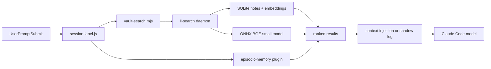
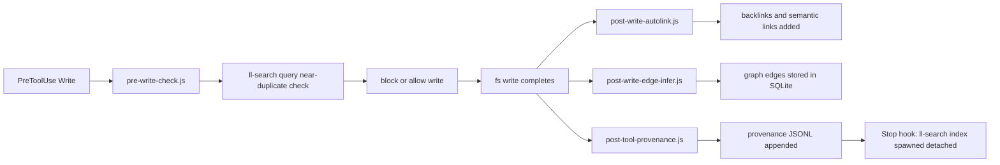

# architecture

learning-loop is a Claude Code plugin with three runtime layers: a JS plugin surface (hooks + scripts), a Rust search daemon (`ll-search`), and a Rust library crate (`ll-core`). This document maps the repo, shows how data flows at runtime, and lists the invariants that must hold across all layers.

Read the baseline docs before touching code:

- `docs/baseline/rust.md` -- ll-core and ll-search conventions
- `docs/baseline/plugin.md` -- hook and script conventions
- `docs/baseline/cross-cutting.md` -- versioning, perf, observability

---

## repo map

```
learning-loop/
  hooks/                -- Claude Code lifecycle hooks (entry: *.js)
    lib/                -- hook-shared helpers (snapshot, inject, log)
    session-start.js    -- vault context injection on session open
    session-label.js    -- just-in-time injection pipeline on each prompt
    post-tool.js        -- search query tracking
    pre-write-check.js  -- duplicate detection before vault write
    stop-nudge.js       -- /reflect nudge on session close
    pre-compact.js      -- context capture before compaction
    post-*.js           -- provenance, autolink, edge-infer, read-retrieval

  scripts/              -- CLI utilities and long-running daemons
    lib/                -- shared primitives (env, config, file-lock, log, etc.)
    librarian.mjs       -- librarian daemon: tag suggest, duplicate detect
    vault-search.mjs    -- ll-search query wrapper
    watch.mjs           -- file watcher daemon
    edges-cli.mjs       -- graph edge management CLI
    provenance*.mjs     -- provenance event read/write

  native/               -- Rust workspace
    crates/
      ll-core/          -- published library crate (crates.io 0.1.x)
                        -- scoring, graph, rerank, embeddings
      ll-search/        -- daemon binary (ships with plugin)
                        -- search, index, sync, NLI

  tests/                -- Node.js tests (node --test)
  docs/
    baseline/           -- convention docs (this directory)
    superpowers/        -- plan archives
  guide/                -- user-facing docs (configuration, workflows)
  skills/               -- Claude Code skill definitions (markdown)
  agents/               -- agent definitions (markdown)
  plugins/
    omc-cache-health/   -- cache health subplugin
  calibration/          -- calibration harness
  provenance/           -- provenance event log
  bench/                -- plugin bench harness
  vendor/               -- vendored schemas and NLP libs
  .planning/            -- planning artefacts (not shipped)
    inventory/          -- phase -1 audit outputs
    refactors/          -- refactor plans
```

---

## data flow

### read path

A user prompt triggers `session-label.js`. The hook dispatches to vault search and optionally to episodic memory, then injects the top results as context before the model sees the prompt.



`vault-search.mjs` launches the `ll-search` daemon on first use and keeps it running as a persistent process. Queries go over stdin/stdout as line-delimited JSON. The daemon scores candidates via Reciprocal Rank Fusion (RRF) over vector similarity, BM25, graph PageRank, and temporal decay.

### write path

A vault note write triggers `pre-write-check.js` before the write and several post-write hooks after. The daemon reindexes asynchronously after the session ends.



The `Stop` hook spawns a detached `ll-search index` after each session. This keeps the vector index fresh for the next session's read path without blocking the current session.

### sync path

Federation sends encrypted vault snapshots to peers over WebSocket. Peers merge the received embeddings into their local index.


Sync runs in the `sync/client.rs` async task on the tokio runtime (migrated from a synchronous thread in v1.19.0). Authentication uses ed25519 signatures; the seed lives in the OS keyring (macOS Keychain, Linux Secret Service) or an encrypted-at-rest file on headless installs, with a plaintext-legacy fallback for un-migrated installs. The wire format negotiates `protocol_version` on `SyncHello`/`SyncReady`: v2 hubs receive length-prefixed envelopes (`u32 size + 32-byte SHA256 + body`) validated before allocation, with a 50 MB hub-side cap on uploads.

---

## module ownership

| Subsystem                  | Primary files                                            | Convention doc                   | Inventory artefact                          |
| -------------------------- | -------------------------------------------------------- | -------------------------------- | ------------------------------------------- |
| ll-core scoring            | `native/crates/ll-core/src/scoring.rs`                   | `docs/baseline/rust.md`          | `.planning/inventory/ll-core-api.md`        |
| ll-core embeddings         | `native/crates/ll-core/src/embed.rs`, `store.rs`         | `docs/baseline/rust.md`          | `.planning/inventory/ll-core-api.md`        |
| ll-core graph              | `native/crates/ll-core/src/graph.rs`                     | `docs/baseline/rust.md`          | `.planning/inventory/ll-core-api.md`        |
| ll-search query pipeline   | `native/crates/ll-search/src/search/`                    | `docs/baseline/rust.md`          | `.planning/inventory/rust-audit.md`         |
| ll-search database         | `native/crates/ll-search/src/db/`                        | `docs/baseline/rust.md`          | `.planning/inventory/rust-audit.md`         |
| ll-search daemon lifecycle | `native/crates/ll-search/src/main.rs`, `app/` (track 0G) | `docs/baseline/rust.md`          | `.planning/inventory/rust-audit.md`         |
| ll-search sync             | `native/crates/ll-search/src/sync/`                      | `docs/baseline/cross-cutting.md` | `.planning/inventory/rust-audit.md`         |
| Plugin shared primitives   | `scripts/lib/`                                           | `docs/baseline/plugin.md`        | `.planning/inventory/plugin-patterns.md`    |
| Hooks                      | `hooks/`                                                 | `docs/baseline/plugin.md`        | `.planning/inventory/coverage-and-magic.md` |
| Provenance                 | `provenance/`, `scripts/provenance*.mjs`                 | `docs/baseline/cross-cutting.md` | `.planning/inventory/plugin-patterns.md`    |

---

## critical invariants

These must hold across all layers after phase 2. Violations are CI failures.

1. `process.env.X` is read only in `scripts/lib/env.mjs`. Every other file imports `env` from there. See `docs/baseline/plugin.md`.

2. `JSON.parse(fs.readFileSync(...))` does not appear outside `scripts/lib/safe-load.mjs`. See `docs/baseline/plugin.md`.

3. File locks use `O_CREAT | O_EXCL` only. No `writeFileSync(path, ..., { flag: 'wx' })` for lock acquisition. See `docs/baseline/plugin.md`.

4. `expect()` and `unwrap()` do not appear outside `native/crates/ll-search/src/main.rs` and `#[cfg(test)]` blocks. See `docs/baseline/rust.md`.

5. All public items in `ll-core` have `///` doc comments. See `docs/baseline/rust.md`.

6. `search/` modules do not import from `db/` directly. They go through the `Storage` trait in `app/`. (Pending: track 0G and 1E.) See `docs/baseline/rust.md`.

7. Hook entry files are under 100 LOC; script entry files are under 150 LOC. Logic lives in submodules. See `docs/baseline/plugin.md`.

8. Every ll-core public enum is `#[non_exhaustive]`. See `docs/baseline/rust.md`.

9. The daemon emits compact JSON by default; `--pretty` is an opt-in flag. (Pending: track 2L.) See `docs/baseline/cross-cutting.md`.

10. The ll-core version in `Cargo.toml` is `0.1.x` until phase 2 publishes `0.2.0`. It does not track the plugin version. See `docs/baseline/cross-cutting.md`.

---

## where to start

**New contributor.** Read `CONTRIBUTING.md` first (local checks, CI, commit style). Then read the convention doc for the subsystem you're touching (`docs/baseline/rust.md` or `docs/baseline/plugin.md`). Run `npm test` and `cd native && cargo test --workspace` before pushing. `ARCHITECTURE.md` (this file) gives the big picture; the baseline docs have the rules.

**Hook surface.** The 11 hooks are in `hooks/`. Each has a `HOOK_BUDGET_MS` constant and a `Promise.race` timeout. Read `docs/baseline/plugin.md` and `guide/configuration.md` for context injection architecture. The untested hooks (session-start, post-tool, stop-nudge, pre-compact) are targeted by track 0D; their characterisation tests will lock down current behaviour before any structural changes.

The most complex hook is `session-start.js` at 556 LOC -- a 0D characterisation test is the prerequisite before the phase 1I split into submodules.

**Search daemon.** Start from `native/crates/ll-search/src/main.rs`. The CLI dispatches to `search::query`, `db::index`, and `sync::client`. Hot-path code is in `search/{query,context,federation,graph,reflect}.rs`. The clone inventory in `.planning/inventory/rust-audit.md:251-324` explains the performance targets. The `app/` module (track 0G) does not yet exist; until it does, `AppState` is effectively `main.rs`-local ad-hoc setup.

**ll-core.** Five modules: `embed`, `scoring`, `graph`, `rerank`, `store`. All public items are undocumented at baseline (54 items; see `.planning/inventory/ll-core-api.md:179-238`). Track 0A adds doc comments and the typed `Error`. New code follows `docs/baseline/rust.md`.

No public enums exist in ll-core at baseline -- only structs, a trait, type aliases, constants, and functions. The structs with public fields that are candidates for `#[non_exhaustive]` are `ModelConfig` and `FtsConfig`.

---

---

## runtime topology

A running learning-loop deployment has three long-lived processes and several transient ones:

| Process          | Binary / script                                                        | Lifecycle                                                                                                                                                                                                                        |
| ---------------- | ---------------------------------------------------------------------- | -------------------------------------------------------------------------------------------------------------------------------------------------------------------------------------------------------------------------------- |
| ll-search daemon | `native/crates/ll-search`                                              | Launched by `session-start.js` on first use; stays up until machine restart or explicit kill                                                                                                                                     |
| librarian daemon | `scripts/librarian.mjs`                                                | Launched by session-start on first session; processes background tasks                                                                                                                                                           |
| NLI server (UDS) | inside `ll-search watch` — `native/crates/ll-search/src/nli_server.rs` | Tokio task spawned alongside the fs-watcher; listens at `<plugin-data>/nli.sock`; loads the 233MB NLI model lazily on first request and reuses it. Unix-only. Falls back to subprocess on non-unix or when the socket is absent. |
| Claude Code host | (Claude Code itself)                                                   | Manages hook invocations                                                                                                                                                                                                         |

Transient:

- Each hook runs as a short-lived Node process (stdin to stdout, exit).
- `ll-search index` runs detached after each session (spawned by the Stop hook).
- `scripts/watch.mjs` can run as an optional background file watcher.
- `ll-search nli-batch` / `ll-search nli-check` subprocesses fire from `edge-infer.mjs` when the UDS daemon isn't available (~400ms cold-start each; the daemon path is ~10ms warm).

The ll-search daemon communicates with the plugin over stdin/stdout of a child process. Each query is a line-delimited JSON object. The daemon maintains a persistent SQLite connection and (after track 1E) a cached `SearchContext`.

The NLI server uses a separate transport: a Unix domain socket at `<plugin-data>/nli.sock`, line-delimited JSON, one request per connection, wrapped in a `{schema_version: 1, results: [...]}` envelope. See `native/crates/ll-search/src/nli_server.rs` for the wire protocol and `hooks/modules/edge-infer.mjs` for the client.

---

## dependency graph (simplified)

```
Claude Code
  |
  +-- hooks/*.js          (reads stdin, writes stdout JSON)
  |     |
  |     +-- scripts/lib/  (shared JS primitives)
  |     |
  |     +-- scripts/vault-search.mjs
  |           |
  |           +-- [stdin/stdout] ll-search daemon
  |                   |
  |                   +-- native/crates/ll-core  (scoring, graph, embeddings)
  |                   +-- SQLite (notes, embeddings, links)
  |                   +-- ONNX runtime (BGE-small model)
  |
  +-- scripts/*.mjs       (CLI utilities; also use scripts/lib/ and ll-search)
```

ll-core is a Rust library crate. ll-search links it statically. There is no separate ll-core process.

---

## key design decisions

**Why a daemon binary rather than a Node.js search library?**

The BGE-small ONNX model is 70 MB and takes ~800 ms to initialize. Loading it on every hook fire would add nearly a second to every session start. The daemon loads once and stays in memory, making warm queries 20-50 ms instead of 800+ ms.

**Why SQLite rather than a separate vector database?**

SQLite bundles into the binary (`rusqlite` with `bundled` feature), requires no external service, and handles the combined FTS + metadata + graph queries in a single transaction. A separate vector DB would add an operational dependency without meaningful performance benefit at the 10k-50k note scale. The trade-off is reviewed at 100k+ notes.

**Why Arc<[f32]> for embeddings?**

A BGE-small embedding is 384 f32 values (1536 bytes). Cloning it in a 10k-note candidate loop costs 15 MB of allocation per query. `Arc<[f32]>` is a reference-counted slice: sharing is a pointer copy. The hot-path clone inventory (`.planning/inventory/rust-audit.md:251-324`) shows ~15-20 clone sites in the search pipeline; track 1E eliminates them.

**Why 11 hooks?**

Each hook corresponds to a distinct Claude Code lifecycle event. Learning-loop needs to act at: session open (context injection), prompt submission (just-in-time injection), pre-write (duplicate gate), post-write (backlinks, edges, provenance), and session close (reflection nudge, background reindex). Fewer hooks would require combining unrelated logic; more hooks would fragment the lifecycle unnecessarily.

**Why file-lock.mjs rather than SQLite for JS concurrency?**

Some of the data structures (vault snapshots, provenance JSONL) are not in SQLite. They are plain files. File-based locks (O_EXCL) are the portable primitive for cross-process exclusion on these files. SQLite has its own WAL locking for the database. The two systems are complementary.

---

## hook firing sequence

On session open, hooks fire in this order:

1. `session-start.js` -- context injection, cache cleanup, daemon spawn, vault snapshot
2. (session is now live)
3. On each user prompt: `session-label.js` -- JIT injection pipeline
4. On each Write/Edit tool use:
   - Before: `pre-write-check.js` -- near-duplicate gate
   - After: `post-write-autolink.js`, `post-write-edge-infer.js`, `post-tool-provenance.js`
5. On each Read tool use: `post-read-retrieval.js` -- passive telemetry
6. On each episodic-memory tool use: `post-search-tracking.js`
7. On session close: `stop-nudge.js` -- reflection prompt, background reindex

Each hook has a `HOOK_BUDGET_MS` ceiling. If the budget is exceeded, the hook exits without completing its work. Context injection (`session-label.js`) uses a race cap: both vault search and episodic memory are started concurrently, and the hook emits results for whichever finishes within the cap.

---

## process management

The ll-search daemon is managed via a PID file at `$CLAUDE_PLUGIN_DATA/watch.pid`. Session-start writes the PID on daemon spawn and reads it on subsequent sessions to check if the process is still alive. If the PID is stale, the daemon is relaunched.

The librarian daemon uses a similar pattern at `$CLAUDE_PLUGIN_DATA/librarian.pid`.

Do not kill these processes directly. Use `node scripts/watch.mjs stop` and `node scripts/librarian.mjs stop` which flush pending work before exiting.

Both daemons check for an existing live process before spawning. If `kill -0 <pid>` succeeds, the existing process is reused. Stale PID files (process gone) are detected and overwritten.

---

## ll-search CLI interface

The daemon accepts line-delimited JSON on stdin. Each request has a `cmd` field:

```json
{"cmd": "search", "q": "memory consolidation", "vault": "/path/to/vault"}
{"cmd": "index", "vault": "/path/to/vault"}
{"cmd": "reindex", "vault": "/path/to/vault"}
{"cmd": "similar", "path": "note.md", "vault": "/path/to/vault"}
{"cmd": "intentions", "vault": "/path/to/vault"}
{"cmd": "validate", "vault": "/path/to/vault"}
{"cmd": "export-schema"}
```

Each response is a single line of compact JSON. The `--pretty` flag (planned for track 2L) switches to multi-line for debugging.

The plugin does not call these directly. `scripts/vault-search.mjs` is the intermediary: it manages the daemon process lifetime, handles startup, and serializes concurrent queries.

---

## known structural issues (baseline 2026-05-11)

These are tracked issues, not defects -- the code works, but the structure is not yet at the target.

| Issue                                                       | Location                                                  | Target track             |
| ----------------------------------------------------------- | --------------------------------------------------------- | ------------------------ |
| `search/` calls `db/` directly instead of via Storage trait | `search/query.rs`, `search/reflect.rs`, `search/store.rs` | 0G (trait) + 1E (rewire) |
| `AppState` does not exist; context rebuilt per-query        | `main.rs`                                                 | 0G                       |
| 25 `unwrap/expect` sites outside `main.rs` and tests        | `embed.rs`, `db/query.rs`, `preprocess.rs`                | 1G                       |
| 54 undocumented public items in ll-core                     | all ll-core modules                                       | 0A                       |
| 79 bare `catch {}` blocks in plugin                         | hooks, scripts                                            | 1I                       |
| 26 `process.env.X` reads in 23 files                        | hooks, scripts                                            | 1I (after 0C)            |
| 7 magic `30` top-k constants in Rust                        | `search/query.rs`, `search/graph.rs`, `scoring.rs`        | 0H                       |
| 16 timeout magic numbers in plugin                          | various hooks                                             | 0C (hook-config.mjs)     |

---

---

## session lifecycle in detail

A complete session runs like this. The total wall time for session-start (target p95: 500 ms) covers all steps below:

1. **SessionStart** -- `session-start.js` fires. It: checks for plugin updates, verifies dependencies, takes a vault snapshot, starts the ll-search daemon if not running, assembles memory context (recent captures, intention summary), and writes the context to stdout for Claude Code to inject.

2. **Prompts** -- `session-label.js` fires on every `UserPromptSubmit`. It runs a dual-backend search (vault + episodic memory) with a race cap. In shadow mode it logs the result; in live mode it injects the top context block into the prompt before the model sees it. The label extracted from the conversation is stored for episodic memory retrieval.

3. **Writes** -- `pre-write-check.js` fires before each write and blocks near-duplicate notes (similarity ≥0.85 against existing notes). After each write, three hooks fire: autolink (backlinks), edge-infer (graph edges), and provenance.

4. **SessionStop** -- `stop-nudge.js` fires. If the session was substantial (>50 KB of transcript) and the reflect cooldown has passed, it suggests `/reflect`. Then the Stop hook spawns a detached `ll-search index` to reindex any changed notes.

---

## search algorithm

A search query runs through five stages:

1. **Embed** -- the query string is tokenized and embedded via BGE-small to a 384-dimension vector.
2. **Vector score** -- dot product between the query vector and all stored note embeddings. Top 30 by default (see `coverage-and-magic.md:241-247` for the 7 sites where this constant appears).
3. **BM25 score** -- full-text search on the SQLite FTS5 index. Top 30 candidates.
4. **Graph expansion** -- personalized PageRank over the link graph seeded by the initial vector + BM25 candidates.
5. **RRF fusion** -- Reciprocal Rank Fusion merges all ranked lists into a final score. `finalize_rrf(scores, top_n)` returns the top-n candidates.

Optional stages:

- **Temporal decay** -- exponential decay applied to scores based on note recency. Controlled by `half_life_days` in the search query.
- **Reranking** -- cross-encoder reranking via the `rerank` function in ll-core (`rerank.rs`). Applied to the top-k after RRF to improve precision on the final set.
- **Pseudo-relevance feedback (PRF)** -- Rocchio algorithm re-embeds the query using the top results to expand coverage. Controlled by `PrfParams` in ll-core.
- **Federation** -- peer vault results merged into the local RRF pipeline. Only active when sync peers are configured.
- **NLI gate** -- entailment classifier filters results that don't entail the query. Implemented but not wired into the main query path at baseline (`nli.rs`; `.planning/inventory/rust-audit.md` §9.8).

---

## file format conventions

### provenance JSONL

Each hook appends one line per invocation to `$CLAUDE_PLUGIN_DATA/provenance/YYYY-MM-DD.jsonl`:

```json
{
  "ts": 1747000000,
  "hook": "session-start",
  "event": "fired",
  "session_id": "abc123",
  "vault": "/vault/path"
}
```

Lines are newline-terminated. Corruption recovery (track 2N) will add per-line checksums.

### vault snapshot

`hooks/lib/snapshot.mjs` writes vault state to `$CLAUDE_PLUGIN_DATA/snapshot-<session_id>.json`. Format:

```json
{
  "ts": 1747000000,
  "session_id": "abc123",
  "note_count": 1183,
  "recent_paths": ["path/to/note.md"],
  "intentions": ["research caffeine tolerance"]
}
```

### shadow injection log

`$CLAUDE_PLUGIN_DATA/retrieval/shadow-injection-<session_id>.jsonl` -- one line per prompt-submit event:

```json
{ "ts": 1747000000, "q": "query text", "top_score": 0.43, "would_inject": true, "latency_ms": 35 }
```

Review with `node scripts/review-shadow.mjs` before flipping to live injection mode.

---

## see also

- `docs/baseline/rust.md` -- ll-core and ll-search conventions
- `docs/baseline/plugin.md` -- hook and script conventions
- `docs/baseline/cross-cutting.md` -- versioning, perf, observability, drift prevention
- `CONTRIBUTING.md` -- local checks, CI, commit style, PR checklist
- `guide/configuration.md` -- hook configuration and env vars
- `guide/workflows.md` -- common development workflows
- `.planning/refactors/baseline-2026-05-11.md` -- full refactor plan
